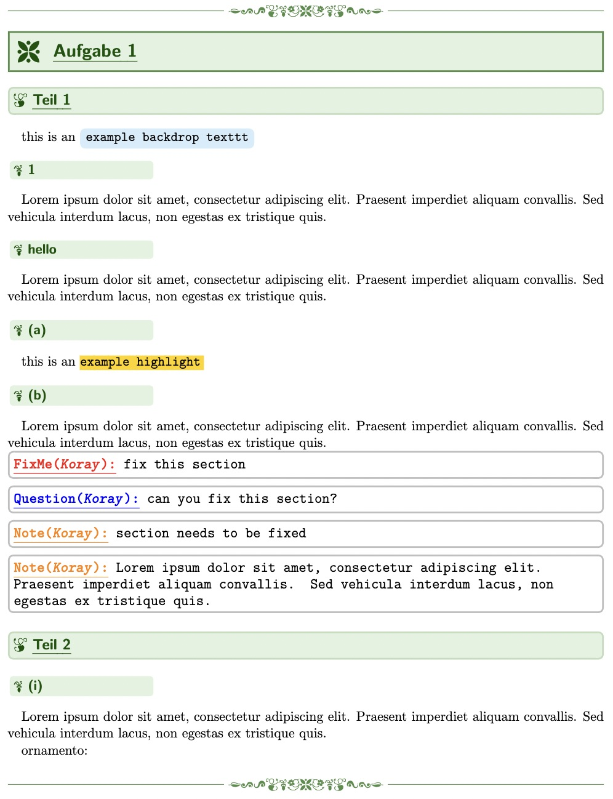

# Koray's latex homework style



This is the style I use in my homeworks. You can find visuals [here](./showcase.pdf).

I'm still learning and honestly have no idea what I'm doing. This repo probably doesn't follow any latex package convensions.

Feel free to open a pull request. 

## Installation

```sh
cd yourProject/
git submodule add https://github.com/KorayUlusan/korays-homework-sty
```

to uninstall:

```sh
cd yourProject/
git rm koray-tex-homework/
```

## Usage

```latex
% You need to include this package in your latex file.
\usepackage{./korays-homework-sty/korayHomework.sty}

% I'd really appricate if you give credit 
\KoraysHomeworkStyCredit % can be added before \end{document}
```

### Answering questions

Since homeworks have a defined structure, it made more sense to write the question numbers by hand. It makes the latex document more readable. (and avoid `\section*{1}`)

```latex
\question{1}
\subquestion{(a)}
\subsubquestion{(i)}
```

### Text styles

```latex
\bdtexttt{text here}
\hltexttt{text here}
```

### Leaving notes

Its important to leave notes to your teampartners. Better communication better
results. 

```latex
% first create a command per person
\newcommand{\noteKoray}[1]{\commentPerson{orange}{Note}{Koray}{#1}}

% then you can use it
\noteKoray{text here}
```

Examples:

```latex
\newcommand{\fixmeKoray}[1]{\commentPerson{red}{FixMe}{Koray}{#1}}
\newcommand{\questionKoray}[1]{\commentPerson{blue}{Question}{Koray}{#1}}
\newcommand{\noteKoray}[1]{\commentPerson{orange}{Note}{Koray}{#1}}
```

### Changing Color Theme

You can overwrite these theme colors

- `themeColor`
- `titleColor`
- `contourColor`
- `decorativeColor`
- `backdropcolor`
- `highlighcolor`

```latex
% for example
\definecolor{mycolor}{HTML}{FFD400} % hex must be capitals
\colorlet{themeColor}{mycolor} % overwrite
```

### Decorations

```latex
\ornamento
\ornamentoL
\ornamentoR
```
